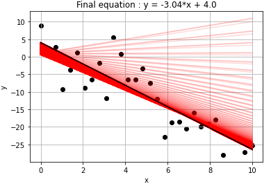

<br />

<h1 align="left">Linear regression with Gradient Descent</h1>

<p align="center">
    
</p>


<!-- ABOUT THE PROJECT -->
## About The Project

To better understand the gradient descent algorithm, I've tried to implement it from scratch for a simple problem : linear regression.

I've implemented :
* Classic GD
* SGD
* Mini-batch SGD

Disclaimer : Using gradient descent to find the coefficients of a line's equation is not the best way to do as the coefficient can be calculated analytically using linear algebra. Implementing it from scratch is just a way for me to better understand the gradient descent algorithm.

### Prerequisites

* Python  ⩾ 3.8
  ```sh
  sudo apt install python3 python3-pip
  ```

### Installation


1. Clone the repo
   ```sh
   git clone https://github.com/Clement-W/Linear-Regression-SGD.git
   cd Linear-Regression-SGD/
   ```
3. Create and activate a virtual environment
   ```sh
   pip3 install virtualenv --upgrade
   virtualenv venv
   source venv/bin/activate
   ```
4. Install the requirements
   ```sh
   pip3 install -r requirements.txt
   ```

### Demo

To see a demo, check the notebook file "LinearRegression_GD.ipynb". You'll find multiple examples of linear regression with classic gradient descent, stochastic gradient descent and mini batch stochastic gradient descent.

## Contributing

I'm still learning machine learning, so feel free to use Issues or PR to report errors and/or propose additions or corrections to my code.
